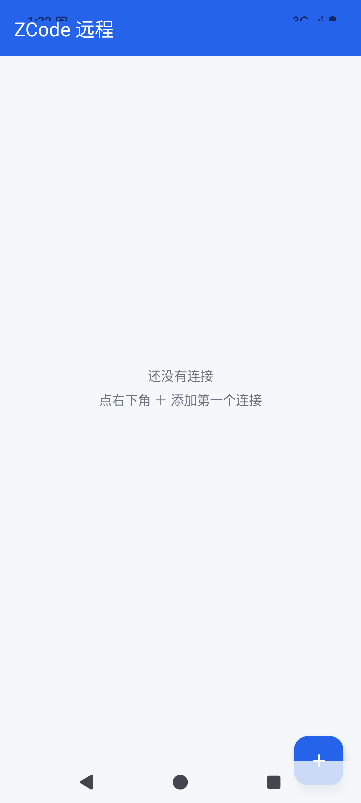
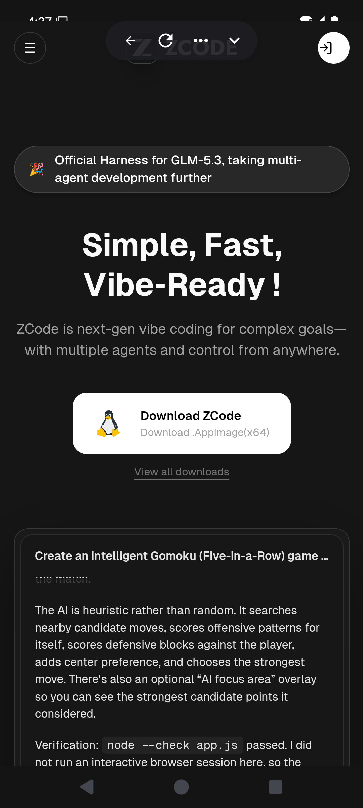
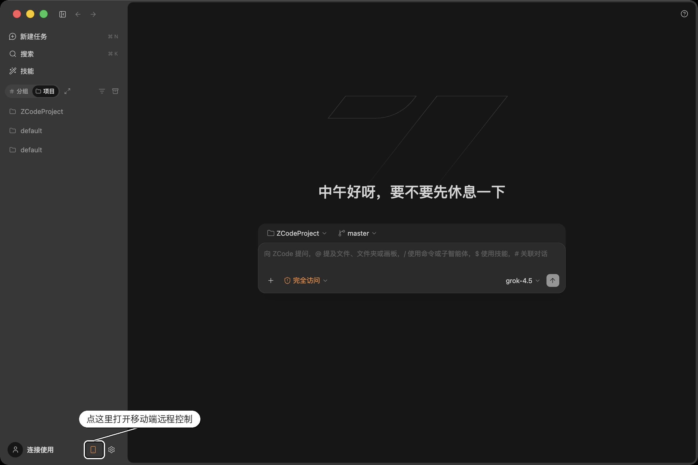
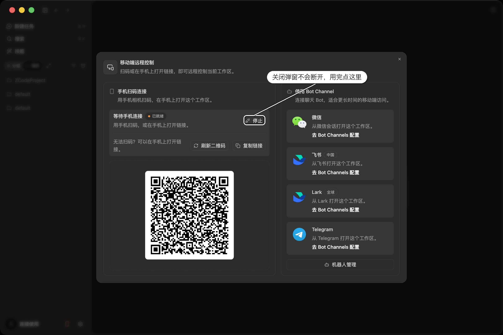

# ZCode 远程手机平板连接控制

> 把 ZCode 桌面端的「手机连接」远程功能封装成安卓 App，**手机、平板都能用**：保存链接、一键连接，不用每次到电脑前扫码。
>
> Control your ZCode workspace from your **phone or tablet** — save the link once, connect with one tap, no more scanning a QR code at your desktop every time.

[](https://github.com/Deep-AI-Evo/zcode-remote-apk/releases/latest)
[](LICENSE)

---

> ⚠️ **第三方非官方版本**：本应用与智谱 / ZCode 官方**无任何关系**，只是把官方「手机连接」网页封装成安卓 App，不改动任何官方协议和鉴权。
>
> 🔒 **权限极少**：全应用仅申请「网络」（加载远程页面）和「相机」（扫码添加链接）两类权限。**无账号、无定位、无通讯录、无存储访问、无后台常驻**。

> ⚠️ **Unofficial third-party build**: not affiliated with Zhipu AI / ZCode in any way. It only wraps the official "Phone Connect" web page into an Android app and does not modify any official protocol or authentication.
>
> 🔒 **Minimal permissions**: the app requests only two permission types — Network (to load the remote page) and Camera (to scan the QR link). **No account, no location, no contacts, no storage access, no background services.**

---

## 立即下载 / Download

**👉 安装包在这里：** [前往 Releases 下载最新版 APK](https://github.com/Deep-AI-Evo/zcode-remote-apk/releases/latest)

- APK 即装即用，**不需要自己构建**。
- 下载后安装到安卓手机，允许「未知来源」即可。
- 打开 App → 电脑端 ZCode 点「手机连接」→ 在 App 里**扫码**或**粘贴**链接 → 一键连接（详见下方 [使用](#使用--usage)）。

For most users there is no need to build it yourself — grab the signed APK from
[Releases](https://github.com/Deep-AI-Evo/zcode-remote-apk/releases/latest), install it on your
Android phone (allow unknown sources), import the link once, and connect with one tap.

---

## 简介 / Introduction

ZCode（智谱 AI 编程环境）桌面端自带 **Web 远程控制（webRemoteControl）**：点「手机连接」会生成一个二维码，手机扫码后在浏览器里打开一个网页，即可实时查看/控制当前工作区。麻烦在于：每次都要到电脑前点按钮、掏出手机扫码。

这个 App 把它「包一层」：**首次把远程链接录进来（扫码或粘贴），之后打开 App 点一下卡片就进入远程页面**——界面和你扫码后手机上看到的官方远程控制页完全一样。

ZCode's desktop app ships with **Web Remote Control**: click "Phone Connect", a QR code appears, and scanning it opens a web page on your phone for real-time viewing/controlling of the current workspace. The pain: you have to walk to the desktop, click the button, and scan the code every time.

This app wraps that into a small Android client: **record the remote link once (scan or paste), then tap the card to enter the remote page** — the in-app page is exactly the official mobile remote-control page you'd see after scanning.

## 功能 / Features

- 📱 **一键连接**：保存的远程链接点一下就进，App 内 WebView 承载官方远程页面（JS / DOM storage 全开，支持移动端适配）
- 📷 **扫码添加**：内置二维码扫描（ZXing），对准电脑屏幕即可录入链接
- 📋 **粘贴导入**：也支持直接粘贴链接
- 💾 **连接管理**：卡片列表保存多条连接；长按可复制链接 / 删除（带确认）
- 🧭 **WebView 增强**：返回键按页面历史回退、刷新按钮、系统浏览器打开、更换链接；加载失败有明确提示
- 🔒 **纯本地**：连接数据存 SharedPreferences，无账号、无云同步、不依赖 Google 服务（国内可用）

- 📱 **One-tap connect**: tap a saved link and you're in — the official remote page runs inside an in-app WebView (JavaScript/DOM storage enabled, mobile-viewport aware)
- 📷 **QR scanning**: built-in scanner (ZXing) — point at the desktop screen to import a link
- 📋 **Paste import**: paste the link directly
- 💾 **Connection manager**: keep multiple connections as cards; long-press to copy the link or delete (with confirmation)
- 🧭 **WebView niceties**: hardware back walks page history, toolbar refresh, open-in-system-browser, change-link; clear error toast on load failure
- 🔒 **Fully local**: connections live in SharedPreferences — no account, no cloud sync, no Google Play Services dependency

## 权限说明 / Permissions

隐私透明：下表是本应用申请的**全部**权限，没有其他任何权限。

Privacy first — the table below is the **complete** list of permissions this app requests, nothing else.

| 权限 Permission | 用途 Purpose | 敏感 Sensitive |
| --- | --- | --- |
| 网络 INTERNET | 加载远程连接页面 Load the remote page | 否 No |
| 使用相机 CAMERA | 扫码录入链接，仅扫码时使用 Scan the QR link, used only while scanning | 否（拒绝后仍可粘贴链接）No (paste still works if denied) |
| 查看网络状态 ACCESS_NETWORK_STATE | 网络状态检测 Network state | 否 No |

**没有申请 / Not requested**：账号登录、定位、通讯录、相册/存储、麦克风、短信、通话、后台常驻、开机自启。所有连接数据仅保存在本机。

No account login, no location, no contacts, no photos/storage, no microphone, no SMS, no calls, no background services, no boot autostart. All connection data stays on your device.

> 网页里的**图片/文件上传**已支持：走系统文件选择器（Android 存储访问框架），选图过程不需要也不申请存储类权限。
>
> File/image uploads inside the remote page work through the system file picker (Android Storage Access Framework) — no storage permission is needed.

## 截图 / Screenshots

| 首页空态 / Empty home | WebView 连接页 / Connect view |
| --- | --- |
|  |  |

> 连接页截图演示的是用示例链接 `https://zcode.z.ai` 打开官网的效果；录入真实「手机连接」链接后，App 里展示的就是官方远程控制页面。
>
> The connect screenshot shows the official site loaded with a sample link (`https://zcode.z.ai`); once you import a real "Phone Connect" link, the in-app page is the actual remote-control UI.

## 使用教程 / Usage

### 第 1 步：在电脑端 ZCode 获取连接二维码 / Get the QR code on desktop

依据 [ZCode 官方文档 · Remote Control](https://zcode.z.ai/cn/docs/remote-control)（图文来源：智谱官方）。

**① 打开入口**：在 ZCode 桌面端**左下角侧栏**，点击**手机图标**（在"连接使用"右侧、设置齿轮旁边），打开「**移动端远程控制**」弹窗。



**② 获取二维码 / 链接**：弹窗**左侧**就是「手机扫码连接」区域——一个大二维码，下方有「**复制链接**」「**刷新二维码**」按钮（弹窗右侧是 Bot Channel 入口，微信/飞书/Telegram 长期接入，与本 App 无关，可忽略）。



**③ 官方注意事项**（与本 App 使用直接相关）：

- 🔑 连接地址自带远控授权，**等同临时钥匙，不要公开或转发**
- ♻️ 点「刷新二维码」后**旧地址立即失效**——这就是本 App 里"链接过期"的原因，失效时回添加页重新扫码/粘贴即可
- 📱 **同一时间只支持一个手机页面**连接，换设备前先关掉旧页面
- ⏹️ **关闭弹窗 ≠ 断开**，用完要点弹窗右上角的「**停止**」按钮

### 第 2 步：把链接录入本 App / Import into this app

1. 手机安装本 App，点右下角 **＋**；
2. 对着电脑屏幕**扫码**，或点弹窗里「复制链接」后在 App 里**粘贴**（可录多条连接）；
3. 回到首页点卡片 → 一键进入远程页面。

### 手机端能做什么 / What you can do on the phone

官方远程页面提供（与本 App 内看到的一致）：

- **任务首页**：按工作区/时间线组织任务、新建任务、对断开的远程工作区发起重连、查看运行状态
- **会话页**：实时查看 Agent 回复与执行进度、补充需求让 Agent 继续、点赞/点踩反馈、会话分叉
- 命令始终在桌面端工作区连接的机器上执行（本地电脑 / SSH 主机 / WSL / Docker）

1. Install the APK and tap the **＋** FAB — scan the QR on the desktop screen or paste the copied link.
2. Back on home, tap a card → you're in the remote page.

## 原理 / How it works

ZCode's mobile link is a cloud-relay web page: the QR/copy link points to `https://zcode.z.ai` (or `zcode.chatglm.site`) `/remote/v3|v4/...`, pairing the desktop with your phone over Zhipu's relay (`wss://…/ws`). The phone side is just a web page, which is exactly what the in-app WebView loads — so the wrapper needs no protocol work of its own.

ZCode 的手机连接本质是一个走智谱云 relay 的网页：二维码/复制链接指向 `https://zcode.z.ai`（或 `zcode.chatglm.site`）的 `/remote/v3|v4/...`，通过 relay（`wss://…/ws`）把桌面端与手机配对。手机端只是一个网页——App 内 WebView 直接加载它即可，包装层不需要自己实现任何协议。该机制与 [ZCode 官方文档](https://zcode.z.ai/cn/docs/remote-control) 描述一致。

## 自己构建 / Build (可选)

> 一般用户不需要自己构建，直接用 [Releases 里的 APK](#立即下载--download) 即可。以下为开发者参考。

For end users there is no need to build — just install the APK from
[Releases](#立即下载--download). The following is for developers.

- JDK 17（`JAVA_HOME` 指向 JDK 17）
- Android SDK：compileSdk 35 / targetSdk 35 / minSdk 26（`local.properties` 里按本机配置 `sdk.dir`）
- 国内网络已在 `settings.gradle.kts` 配置阿里云镜像，Gradle wrapper 发行包走腾讯镜像

```bash
JAVA_HOME=<path-to-jdk17> ./gradlew :app:assembleDebug
# 产物：app/build/outputs/apk/debug/app-debug.apk
```

```bash
JAVA_HOME=<path-to-jdk17> ./gradlew :app:assembleDebug
# Output: app/build/outputs/apk/debug/app-debug.apk
```

## 技术栈 / Tech stack

- Kotlin + AndroidX（AppCompat、Material 3、RecyclerView）
- Android WebView（远程页容器）
- ZXing (`com.journeyapps:zxing-android-embedded`)
- AGP 8.5.2 / Gradle 8.9 / Kotlin 1.9.24

## 项目结构 / Structure

```
app/src/main/java/com/zcode/remote/
├── MainActivity.kt        # 连接列表（长按：复制/删除）
├── AddLinkActivity.kt     # 扫码 / 粘贴导入
├── ConnectActivity.kt     # WebView 一键连接
└── ConnectionsStore.kt    # 本地存储（SharedPreferences）
```

## 路线图 / Roadmap

- [x] Release 签名包 / Signed release builds（v1.0.0）
- [ ] **真·免扫码 / True QR-free**：Mac 常驻小助手自动获取最新远程链接，App 打开即连（需要 ZCode 提供可编程取链接通道，待验证）
- [ ] 更多连接字段（备注名、图标）/ Richer connection profiles

## 免责声明 / Disclaimer

本项目是第三方非官方客户端，仅把 ZCode 官方提供的「手机连接」网页封装为安卓应用，不修改、不绕过任何官方协议或鉴权。与智谱/ZCode 无隶属关系。

This is an unofficial third-party client. It merely wraps the official "Phone Connect" web page into an Android app; it does not modify or bypass any official protocol or authentication, and is not affiliated with Zhipu AI / ZCode.

## 许可证 / License

[MIT](LICENSE)

---

**壹我AI** 制作 · Made by 壹我AI